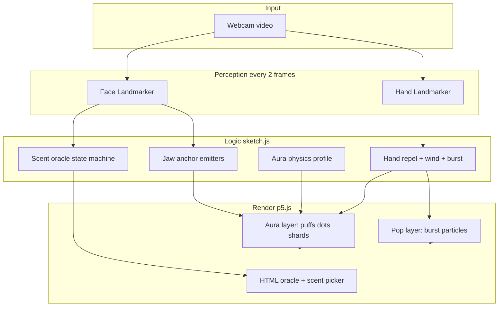

# Augmented Face — Project overview for presentations

**Purpose of this document:** Give designers and presenters a single source to build slides—what the demo is, how it feels, which brands appear, and how interactions work. Technical tuning lives in [AURA_PARAMETERS.md](./AURA_PARAMETERS.md); day-to-day setup is in [README.md](../README.md).

**Live demo:** https://ayymer.github.io/Augmented-Face/ (camera permission required)

**Local run:** `npm start` → http://127.0.0.1:5173/ · add `?debug=1` for on-screen stats

---

## 1. Elevator pitch

**Augmented Face** is a browser-based, real-time AR-style prototype: the webcam sees your face and hands, and the app wraps the jaw in animated **perfume-inspired particles** (flowers, bottles, shells, leaves, etc.). Each session suggests a **scent identity** (oracle), then the user can **fan the cloud away with the hand** or **trigger a spray burst** by opening a fist—like dispersing fragrance in air.

Built as an interactive visual showcase for four perfume directions: **Alima**, **Aymeric**, **Jamie**, and **Paloma**.

---

## 2. What the audience sees (user journey)

| Step | On screen | Duration (typical) |
|------|-----------|-------------------|
| 1. **Position face** | Message: “Position your face” | Until face detected |
| 2. **Oracle loading** | “Reading your aura…” + spinner | ~0.9 s |
| 3. **Oracle reveal** | Scent name + tagline (e.g. “Alima — Soft floral drift”) | ~3 s |
| 4. **Oracle fade** | Overlay fades; jaw **aura** starts | ~0.6 s |
| 5. **Experience** | Continuous particles around chin/jaw; hand interactions | Open-ended |
| 6. **Optional** | Side panel: pick another scent or **↻ New aura** (new random physics) | Any time after step 5 |

**Important for slides:** The aura is anchored on the **jaw and lower face**, not the forehead. The hand does **not** move the spawn point—it **pushes, clears, and bursts** particles that already exist.

---

## 3. Feature list (slide-ready bullets)

### Core

- **Live mirrored webcam** full-screen canvas (p5.js).
- **Face tracking** — MediaPipe Face Landmarker (single face).
- **Hand tracking** — MediaPipe Hand Landmarker (single hand).
- **Scent oracle** — automatic random scent when face appears; branded title card.
- **Manual scent picker** — four radio options after oracle completes.
- **New aura** — re-roll random physics profile for the current scent.

### Visual aura (jaw)

- **Image puffs** — PNG motifs (perfume bottles, flowers, shells, etc.) with fade-in / solid / fade-out.
- **Colored dots** — small halo specks sampled from each image’s colors.
- **Radial emergence** — particles spawn outward from face center, then each enters its **own random drift** after 1–3 seconds.
- **Per-load physics profile** — every scent apply randomizes size, speed, opacity, spawn density, dot edge behavior, and face collision style.

### Hand interactions (two complementary modes)

| Interaction | Gesture | Effect |
|-------------|---------|--------|
| **Perfume wind** | Move an **open palm** through the cloud (swipe / fan) | Pushes particles along hand motion; faster swipe = stronger gust; clears scent faster in the wind zone |
| **Spray burst** | **Fist** (hold) → **open hand** (release) | One-shot explosion of image puffs + dots at the palm; brief nudge on jaw emitters |

### Physics & polish

- **Face repel** — particles pushed away from the face (smooth tracking).
- **Hand repel** — strong, instant bubble around the hand (clears assets on contact).
- **Soft peer repulsion** — particles gently avoid stacking in one spot.
- **Shatter** (profile-dependent) — some image puffs break into colored shards when hitting face/hand hard.
- **Screen edges** — dots may bounce or drain at edges; **image puffs pass through** edges (no pile-up at bottom).

---

## 4. The four scents (brand table)

| Key | Display name | Tagline | Visual identity | Spawn variety |
|-----|--------------|---------|-----------------|---------------|
| **alima** | Alima | Soft floral drift | Flowers, perfume bottle, floral stills (11+ assets) | One image per jaw anchor (rotates) |
| **aymeric** | Aymeric | Autumn leaf — Maison Margiela | Maple leaf (Aymeric) | Random leaf from pool each spawn |
| **jamie** | Jamie | Salt, citrus, shell-light | Shells, glass, oranges, leaves, bottle | Random from full pool |
| **paloma** | Paloma | Warm sun, tropical lift | Sun, leaves, mango, bottle | Random from full pool |

**Asset folders:** `Assets/alima/`, `Assets/aymeric/`, `Assets/jamie/`, `Assets/paloma/`

**Scale note:** Jamie and Paloma use a smaller default asset scale (~67%) so art matches Alima on screen.

---

## 5. System architecture (for technical slides)

**Stack**

| Layer | Technology |
|-------|------------|
| Page | HTML + CSS (`index.html`, `style.css`) |
| Drawing | p5.js (canvas, webcam, blend modes) |
| Tracking | MediaPipe Tasks Vision 0.10.20 (CDN, WASM) |
| Logic | Single module `sketch.js` (~2.4k lines) |
| Deploy | Static site (GitHub Pages) |

No bundler required for production; optional `npm start` for local static server.

---

## 6. Particle behavior (story for motion-design slides)

### Phase A — Emergence (0–3 s)

- Emitters sit along the **jaw line** (15 points) plus **5 extra chin placements**.
- New **image puffs** and **dots** spawn with outward velocity from the **face center**.
- Gentle **turbulence** and **drag** keep motion organic.
- **Face repel** keeps the halo from covering cheeks/nose.

### Phase B — Individual drift (after random 1–3 s per particle)

- Each particle picks a **random direction** and speed.
- Weak pull back toward the face remains (12% of normal radial force).
- Motifs float like scent lingering in air.

### Burst particles (fist-open only)

- Skip the delayed drift system.
- Spawn at the **palm** with directional spray (wrist → fingers).
- Can still be **pushed by hand wind** and **hand repel**.

---

## 7. Random aura profile (why every “New aura” feels different)

Rolled once whenever a scent is applied (oracle, picker, or reload). Not shown to the public; optional seed in debug overlay.

| Category | What varies | Audience-visible effect |
|----------|-------------|-------------------------|
| **Scale** | Asset size multiplier | Delicate vs bold cloud |
| **Motion** | Speed, drag, turbulence | Calm mist vs busy swarm |
| **Life** | Lifetime, fade curves | Short whisper vs long linger |
| **Density** | Spawn interval, dot rate | Sparse vs rich jaw halo |
| **Dots at screen** | none / soft bounce / hard bounce / drain | Dots stay on screen or die at edges |
| **Face collision** | soft / firm / shatter | Gentle push vs violent breakup on face |

**Hand physics are not profile-randomized** — hand repel and wind are always strong and responsive.

---

## 8. Hand interaction reference (presenter cheat sheet)

### Open palm — “fan the perfume”

- **Do:** Wide, deliberate swipes through the jaw cloud.
- **Feel:** Particles stream in the direction of the hand; open fingers increase fan strength.
- **Clear:** Fast swipes add extra fade in the wind zone (clean up the scent).

### Fist → open — “spray pulse”

- **Do:** Close hand (fist), then open quickly.
- **Feel:** Burst of bottles/flowers/dots from the palm; jaw aura gets a short directional nudge.
- **Cooldown:** ~24 frames between bursts to avoid double triggers.

### Hand collision (always on when hand visible)

- Large **repel bubble** around the hand (stronger than face).
- Raw hand position every frame (no lag vs smoothed face).
- Image assets **shoved aside**; can **shatter** if profile allows and impact is hard enough.

---

## 9. Key parameters (summary tables)

*Full constant names and tuning notes: [AURA_PARAMETERS.md](./AURA_PARAMETERS.md)*

### Tracking & performance

| Parameter | Value | Meaning |
|-----------|-------|---------|
| `FACE_DETECT_EVERY_FRAMES` | 2 | Face + hand ML every 2nd frame (CPU vs smoothness) |
| `FACE_LERP` | 0.72 | Smoothed face position for anchors/repel |
| `numFaces` / `numHands` | 1 | Single user |

### Oracle UI timing

| Phase | Constant | ~Duration |
|-------|----------|-----------|
| Loading | `ORACLE_LOADING_MS` | 900 ms |
| Reveal | `ORACLE_REVEAL_MS` | 3000 ms |
| Fade out | `ORACLE_FADE_MS` | 600 ms |

### Jaw aura anchors

| Parameter | Value | Meaning |
|-----------|-------|---------|
| `ALIMA_COLLAR_COUNT` | 15 | Emitters along jaw |
| `EXTRA_PLACEMENTS` | 5 | Extra chin/cheek spawns |
| `COLLAR_DROP` | 0.3 | Jaw line shifted down |
| `SPAWN_INTERVAL_BASE` | (see code) | Base frames between spawns |

### Hand repel (strong clear)

| Parameter | Value | Role |
|-----------|-------|------|
| `HAND_REPEL_RADIUS_FRAC` | 1.42 | Large push zone |
| `HAND_REPEL_STRENGTH_MUL` | 3.4 | Much stronger than face |
| `HAND_REPEL_CORE_BOOST` | 7.5 | Hard center push |
| `HAND_NEAR_DRAIN_MUL` | 1.55 | Faster clear on contact |

### Hand wind (swipe dispersal)

| Parameter | Value | Role |
|-----------|-------|------|
| `HAND_WIND_MIN_SPEED` | 1.5 px/frame | Minimum swipe speed |
| `HAND_WIND_STRENGTH` | 0.19 | Push strength |
| `HAND_WIND_RADIUS_MUL` | 1.6 | Reach of fan |
| `HAND_WIND_CLEAN_DRAIN` | 2.8 | Extra fade while swiping |
| `HAND_WIND_VEL_DECAY` | 0.9 | Keeps motion between ML frames |

### Hand burst (fist → open)

| Parameter | Value | Role |
|-----------|-------|------|
| `HAND_CLOSE_SPREAD` / `HAND_OPEN_SPREAD` | 0.88 / 1.02 | Fist detect + release |
| `HAND_BURST_PUFF_COUNT` / `DOT_COUNT` | 15 / 26 | Burst particle count |
| `HAND_BURST_SPEED_MUL` | 2.85 | Burst velocity |
| `EXPLOSION_PUSH_FRAMES` | 56 | Jaw nudge after burst |

### Face repel (comparison)

| Parameter | Typical | Role |
|-----------|---------|------|
| `BODY_REPEL_STRENGTH` | 0.34 | Baseline face push |
| `BODY_REPEL_RADIUS_FRAC` | 1.1 | Face zone size |
| Hand vs face | ~3.4× mul | Hand clears cloud aggressively |

---

## 10. UI elements (what to photograph for slides)

| Element | Location | When visible |
|---------|----------|--------------|
| Webcam + particle canvas | Full window | Always |
| Oracle overlay | Center | Waiting / loading / reveal |
| Scent picker | Side panel | After oracle done |
| **↻ New aura** | Side panel header | After oracle done |
| Debug HUD | Top-left | URL `?debug=1` only |

**Debug overlay shows:** FPS, puff/dot counts, hand detected, fist state, wind speed, fan factor, physics profile seed, collision style.

---

## 11. Suggested slide deck outline

1. **Title** — Augmented Face: scent aura on live video  
2. **Problem / intent** — Interactive perfume storytelling in the browser  
3. **Demo video or live link** — GitHub Pages URL  
4. **User journey** — Face → oracle → aura → hand play (Section 2)  
5. **Four scents** — Brand table (Section 4) with sample assets  
6. **Visual design** — Jaw halo, image puffs vs dots, blend mode (screen)  
7. **Motion design** — Two-phase drift (Section 6)  
8. **Interactivity** — Wind vs burst vs repel (Section 8)  
9. **Personalization** — Random aura profile + picker (Section 7)  
10. **Technology** — Architecture diagram (Section 5)  
11. **Parameters / reproducibility** — Point to AURA_PARAMETERS + debug mode  
12. **Roadmap / extensions** — More Aymeric assets, tuning, installation variant  

---

## 12. Demo script (for live presentation)

1. Open demo URL; allow camera; center face.  
2. Wait for oracle (**~4.5 s total**) — read scent name aloud.  
3. Let aura build on jaw for **5–10 s** — describe brand motifs.  
4. **Slow palm swipe** through cloud — “dispersing the fragrance.”  
5. **Fast swipe** — stronger clear.  
6. **Fist → open** near chin — “spray moment.”  
7. Switch scent in picker — new visuals + new physics.  
8. **↻ New aura** — same scent, different motion personality.  

**Tips:** Good lighting on face and hands; keep hand between camera and jaw cloud; open palm for wind.

---

## 13. File map (for appendix slide)

| Path | Role |
|------|------|
| `index.html` | Oracle overlay + scent picker |
| `style.css` | Oracle and UI styling |
| `sketch.js` | All logic: tracking, physics, draw |
| `libraries/p5.min.js` | Canvas runtime |
| `Assets/*` | Brand PNGs |
| `docs/AURA_PARAMETERS.md` | Detailed parameter encyclopedia |
| `docs/PROJECT_PRESENTATION.md` | This document |
| `README.md` | Developer quick start |

---

## 14. Licensing & deployment

- **License:** ISC (see repository).  
- **Deployment:** Static files on GitHub Pages from `main`.  
- **Dependencies:** p5.js and MediaPipe loaded from CDN; no npm install required for viewers.

---

*Last aligned with `sketch.js` hand repel, hand wind, and fist-burst behavior. For numeric changes, treat `sketch.js` as source of truth and refresh Section 9 if constants move.*
